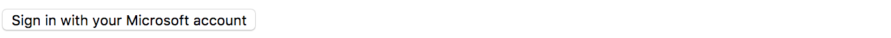
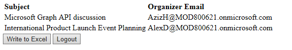
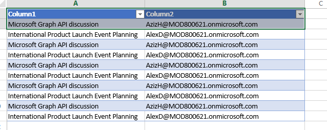

# Hello Microsoft Graph!

This project is showing how you can use [Microsoft Graph](https://developer.microsoft.com/en-us/graph/) in your Angular 4 project.

Microsoft Graph gives you power to interact with Excel, Outlook, OneDrive, OneNote, Planner, Azure AD, SharePoint, etc.

## What this project does
It shows how you can Mircosoft Graph to login with a Microsoft account.

Once you login, it reads the contacts of your Microsoft account.

If you click "Write to Excel" button, it writes the contacts to an Excel file.

> Note before write to Excel, you will need to upload the "demo.xlsx" in this repo to the root folder of your OneDrive.

## How to run

This project was generated with [Angular CLI](https://github.com/angular/angular-cli).
Use `npm start` or `ng serve` to run. Navigate to [http://localhost:4200/](http://localhost:4200/).

## How to create a project by yourself

To create your app, you need get an App ID at [https://apps.dev.microsoft.com/](https://apps.dev.microsoft.com/).

Configure the app with the permissions you need. Check **Allow Implicit Flow**. Update **Redirect URLs**.

This demo needs `Contacts.Read`, `Files.ReadWrite` permissions. The Redirect URLs are `http://localhost:4200`, `http://localhost:4200/home`.

Some of these info also need to be set up in the app [config file](https://github.com/Hongbo-Miao/microsoft-graph-angular/blob/master/src/app/shared/configs.ts).

## Learn More

To learn more about Microsoft Graph, please check [this document](https://developer.microsoft.com/en-us/graph/).
